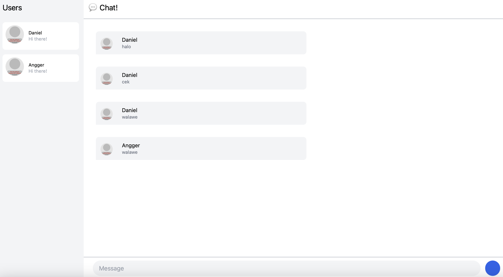
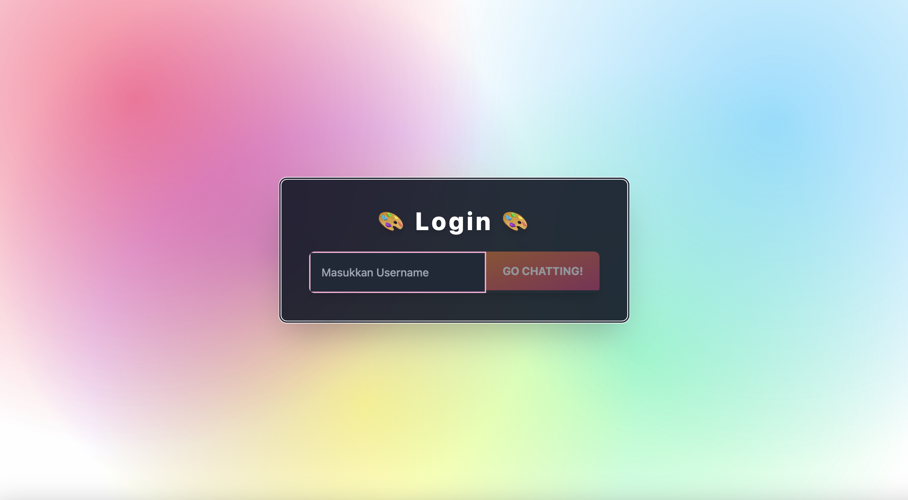
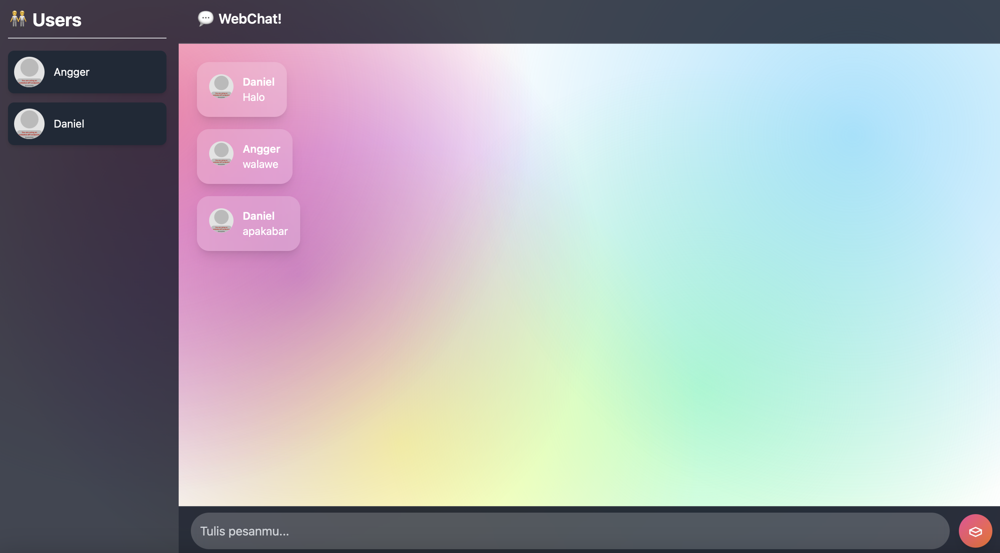

# Tutorial 3: WebChat using yew

## 3.1. Original code

## 3.2: Be Creative!

Pada perubahan "Be Creative!" ini, saya mengubah tema dari aplikasi WebChat ini. Pada desain awal, menurut saya desainnya terlalu monoton dan membosankan. Pada desain awal, background hanyalah putih yang ditambahkan ornamen-ornamen simbol, itupun tidak terlalu signifikan. Jadi, pada "Be Creative!" ini, saya mengubah tema dari aplikasi ini menjadi sedikit lebih warna-warni. Konsep yang saya ambil dalam mendesain ini adalah "cat yang tumpah". Saya mengimplementasikannya dengan membuat background penuh bercak warna-warni transparan, mirip cat tumpah yang menyebar secara acak tapi artistik. Lalu, sidebar (daftar pengguna) dan area chat dibuat kontras dengan background supaya mudah dibaca.Jadi intinya, warna-warna cerah bercampur dengan gelap agar eye-catching tapi tetap nyaman. Perubahan ini mencakup halaman login dan chat.

